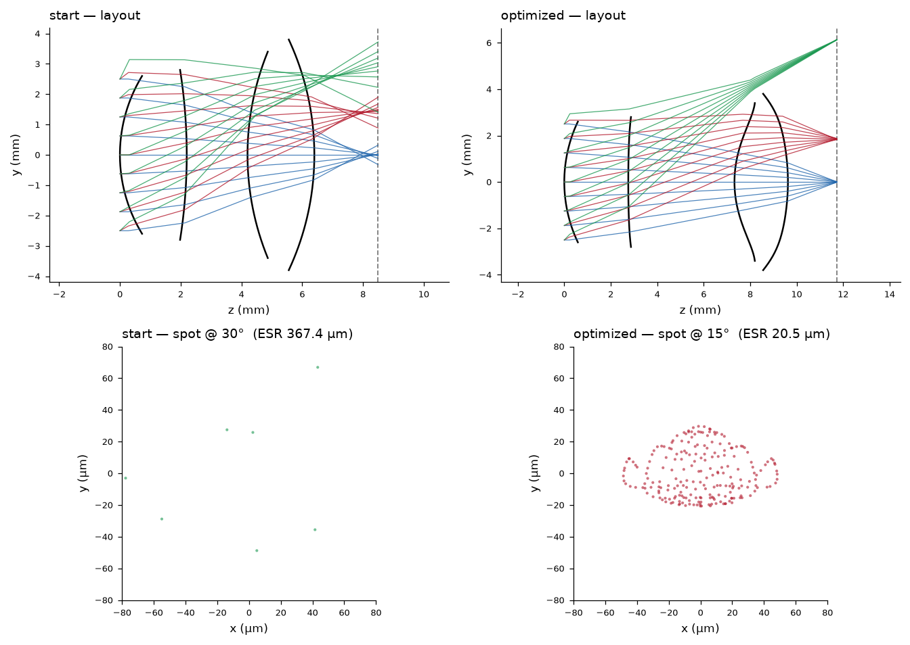
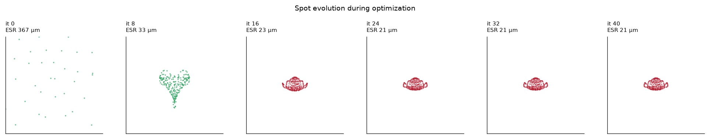
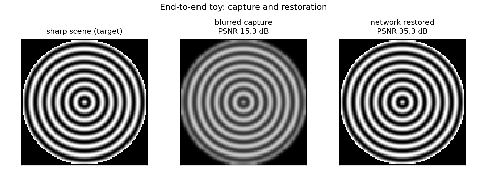

# e2e_optics

A small, modular PyTorch framework for **end-to-end optics + algorithm co-design**,
built around the **GTRA** method of Côté et al., *Generalized Aberrations for
Processing-Aware Optical Design* (2026). It lets you jointly optimize a lens and a
downstream neural network with the fast, second-order **Levenberg–Marquardt (LM)**
optimizer that conventional lens design relies on — instead of falling back to
slow first-order SGD/Adam.

The package is deliberately **three swappable parts connected by backprop**:

```
   scene ──▶  [ OPTICS ]  ──▶  [ BRIDGE ]  ──▶  [ ALGORITHM ]  ──▶  task loss
             ray tracer      GTRA + PSF +        restoration
             (spot diagram)  imaging sim         network
                    ▲              │                   │
                    └──────────────┴───────────────────┘
                        gradients flow back through all three
```

You can change the **optics** (any `BaseOptics`), the **bridge** (any `BaseBridge` —
GTRA is the default "middle part", swappable for something else later), and the
**algorithm** (any `BaseRestoration` — identity, a U-Net, or your own network),
each independently.

---

## At a glance

**Paper-style before/after** — a 2-element toy lens optimized by GTRA-LM, then a
network trained to restore its blur:



**Progressive spot evolution** — the spot shrinking across LM iterations (367 µm → 21 µm):



**End-to-end toy result** — blurred capture 15.3 dB → network-restored 35.3 dB:



More diagnostics (lens layout, spot diagrams, differentiable KDE PSF, convergence
curves, animated evolution) are in [`docs/figures/`](docs/figures/), all generated
by the reusable `e2e_optics.viz` module.

---

## Why GTRA (the one idea to understand)

Classical lens design minimizes a **vector** of ray-aberration residuals
(`M = 2·F·W·P` values), which is exactly what LM needs. But *task-driven* design
minimizes a **scalar** loss (image quality after restoration) → the Jacobian has
rank 1 → LM collapses, so everyone uses SGD.

**GTRA** ("Generalized Transverse Ray Aberration") is a transformation of the
scalar loss back into a per-ray residual vector with the **same value and gradient**
at the current point:

```
ℓ_GTRA(θ) = √w · (ε(θ) − ε′),   w = ‖∇L‖²/(2L),   ε′ = ε₀ − 2L∇L/‖∇L‖²
```

where `ε` is the spot diagram and `∇L = ∂L/∂ε`. This restores LM's fast
convergence for the full end-to-end objective. The crucial trick is an **AD split**:

* `∇L` (the expensive part) is computed **once per LM iteration** by
  **backward-mode** AD through the *whole* pipeline (imaging sim + network + loss);
* the LM Jacobian `J = √w · ∂ε/∂θ` is computed by **forward-mode** AD through the
  **ray tracer only** — cheap, and never touches the network.

This package verifies numerically (see tests) that GTRA's surrogate gradient
**exactly equals** the true task-loss gradient (cosine = 1.0).

---

## Install

```bash
cd e2e_optics
pip install -e .
```

Requires Python ≥ 3.10 and PyTorch ≥ 2.0 (uses `torch.func.jacfwd`/`jacrev`).

> **Sandbox note:** in some restricted containers, importing torch fails with an
> OpenMP affinity error. The package sets the necessary guards
> (`KMP_AFFINITY=disabled`, etc.) in `e2e_optics/__init__.py` before torch loads,
> so `import e2e_optics` is safe. If you import torch elsewhere first, set those
> env vars yourself.

## Run the demo

```bash
python demos/demo_toy_e2e.py
```

Reproduces the structure of the paper's Fig. 4 toy: a 2-element f/2 lens
(EFL 10 mm, 60° FOV) imaging a ring chart, in three stages — starting design →
conventional TRA-LM (min-spot) → end-to-end GTRA-LM + Adam. It writes
`fig_demo_restoration.png` and `fig_demo_summary.png`.

Representative output (CPU, ~2 min):

| stage | effective spot radius | image quality |
|---|---|---|
| starting design | 367 µm | — |
| TRA-LM (min-spot) | **20.5 µm** | blurred capture 15.3 dB |
| end-to-end (GTRA + net) | 20.5 µm | **restored 35.3 dB** |

## Run the tests

```bash
pytest -q          # or: python tests/test_core.py
```

Seven checks: forward/backward-AD agreement on the tracer (~1e-10), KDE PSF energy
conservation, GTRA→TRA reduction, GTRA-gradient = task-gradient, LM convergence,
and toy-lens spot shrinkage under LM.

---

## The four parts

The code base is organized as the four stages you reason about: **optics →
bridge → optimizer → algorithm**.

### 1. Optics — `e2e_optics.optics`
`RotationallySymmetricLens(BaseOptics)`: a differentiable sequential ray tracer.
Even-asphere surfaces, vector Snell refraction, Newton ray–surface intersection,
concentric-ring pupil sampling. Produces a `SpotDiagram`. The pure function
`spot_from_theta(θ)` is what LM differentiates with forward-mode AD.

### 2. Bridge — `e2e_optics.bridge` (the "middle part")
* `gtra.py` — the GTRA lift (`gtra_residuals`, `tra_residuals`). **This is the
  swappable middle piece.** GTRA *contains* conventional TRA as a special case:
  `tra_control_values(spot)` returns the `(w, ε′)` for which GTRA equals TRA
  exactly (`w = 1/(FWP)`, `ε′ = per-field centroid`). Pass them to
  `gtra_residuals(..., w_override=w, eps_prime_override=ε′)` to run the *same*
  code path in TRA mode — TRA is not a separate branch. (Verified element-wise in
  `tests/test_gtra_control_values_give_tra_elementwise`.)
* `kde_psf.py` — differentiable geometric PSF by triangular-kernel KDE (energy
  conserving).
* `imaging.py` — `ConvolutionImaging(BaseBridge)`: PSF → blurred, noisy capture.

### 3. Algorithm — `e2e_optics.algorithm`
* `IdentityRestoration` — the image-driven-design special case (no network).
* `TinyUNet` — a small residual U-Net IRM; swap for NAFNet/Restormer/etc.

### 4. Optimizer — `e2e_optics.optimizer`
* `LevenbergMarquardt` — damped Gauss–Newton with adaptive λ, running-max Marquardt
  damping, and step rejection (monotone convergence). Jacobian via `jacfwd`.
  `run(n, callback=...)` calls `callback(state)` after each accepted step — the
  hook the visualization recorder uses.
* `JointOptimizer` — the alternating loop: a GTRA-LM lens step (network frozen)
  then an Adam network step (lens frozen). **Read this file first** to see how the
  four parts connect and where the AD split happens.

### Visualization — `e2e_optics.viz`
Reusable diagnostics so the plots are part of the code base, not throwaway
script cells:
* **Single-state:** `plot_lens_layout`, `plot_spot_diagram`, `plot_psf`,
  `plot_convergence`.
* **Before / after (paper Fig. 4 style):** `compare_lenses(lens, θ_before,
  θ_after)` (2×2 layout + spot, side-effect free), `plot_restoration`.
* **Progressive / evolution:** `OptimizationRecorder` (pass as the LM
  `callback`), then `plot_spot_evolution` for a grid or `animate_spot_evolution`
  for a GIF of the spot shrinking across iterations.

All layout plots are backed by `RotationallySymmetricLens.ray_paths()`, which
traces meridional ray fans through the system for the cross-section.

```python
from e2e_optics import viz, OptimizationRecorder
rec = OptimizationRecorder(lens)
lm.run(40, callback=rec)
viz.compare_lenses(lens, theta_start, lm.theta, view_um=80)   # paper-style
viz.animate_spot_evolution(lens, rec, "spot_evolution.gif")   # progressive
```

---

## Swapping a part

Everything is chosen by name through one config:

```python
from e2e_optics.config import PipelineConfig, build_pipeline

cfg = PipelineConfig(
    optics="rotational_lens",
    bridge="kde_conv",
    algorithm="tiny_unet",             # or "identity"
    optics_kwargs=dict(...),
    algorithm_kwargs=dict(width=16),
)
optics, bridge, algo = build_pipeline(cfg)
```

To add your own network, subclass `BaseRestoration` (and `torch.nn.Module`),
implement `restore()`, and register it in `config._algorithm_registry()`. Same
pattern for a new optics model (`BaseOptics`) or a new middle-part residual
(add a function alongside `gtra_residuals`). No other code changes are needed —
that is the whole point of the design.

See `docs/ANALYSIS_AND_DESIGN.md` for the full paper analysis, the
equation-to-code cross-reference, and the extension guide (diffraction
compensation, ray aiming, dispersion, spatially-varying convolution, NAFNet+Wiener
IRM — all present as documented stubs).

---

## Scope of v1

This is the **minimal runnable slice**: monochromatic, front-stop, shift-invariant
convolution, single scene in the demo, small network. The physics the paper
validates against CODE V (dispersion, vignetting/ray-aiming, diffraction-compensated
PSF, overlap-add SV convolution, the full NAFNet+Wiener restorer) is present as
**documented extension hooks** — clearly marked `NotImplementedError` stubs with
the relevant supplementary-section references — so the framework is honest about
what is implemented and gives you obvious places to contribute.

## Citation

Côté et al., *Generalized Aberrations for Processing-Aware Optical Design*,
ACM Transactions on Graphics (2026). DOI: 10.1145/3817055.
